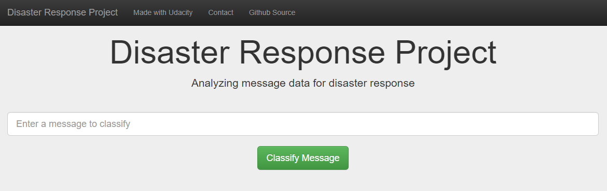
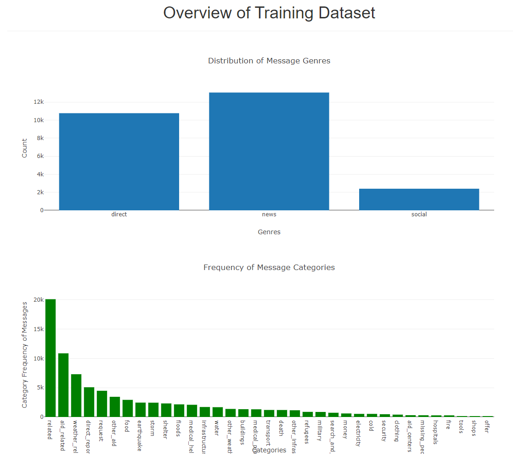
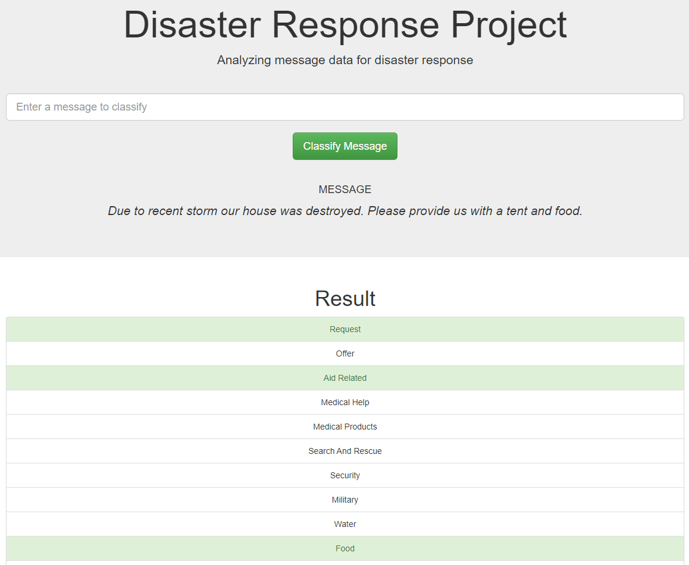

# Project Disaster Response Pipeline

# Goal

The project goal is to create a model for classifying messages sent during disasters. 

## Project Description

There are 36 predefined categories, e.g. "relief", "medical aid", "search and rescue", etc.in this project's data. By classifying these messages, we enable these messages to be routed to the appropriate disaster relief organization. This project involves building a basic ETL and machine learning pipeline to facilitate this task. It is also a multi-label classification task, as a message may belong to one or more categories. We will work with a dataset provided by [Figure Eight] (https://www.figure-eight.com/) that contains real messages sent during disaster events.

The final output is a web app where you can input a message and get classification results.

# Installation

The project must run with Python 3 with libraries of numpy, pandas, sqlalchemy, re, NLTK, pickle, Sklearn, plotly and flask libraries.

### Instructions:
1. Run the following commands in the project's root directory to set up your database and model.

    - To run ETL pipeline that cleans data and stores in database
        `python data/process_data.py data/disaster_messages.csv data/disaster_categories.csv data/DisasterResponse.db`
    - To run ML pipeline that trains classifier and saves
        `python models/train_classifier.py data/DisasterResponse.db models/classifier.pkl`

2. Go to `app` directory: `cd app`

3. Run your web app: `python run.py`

4. Follow the link to open the web app.

# File Description

1. App folder including the templates folder and "run.py" for the web application
2. Data folder containing "DisasterResponse.db", "disaster_categories.csv", "disaster_messages.csv" and "process_data.py" for data cleaning and transfering.
3. Models folder including "classifier.pkl" and "train_classifier.py" for the Machine Learning model.
4. README file

~~~~~~~
      project_disaster_response_pipeline
            |-- app
                |-- templates
                        |-- go.html
                        |-- master.html
                |-- run.py
            |-- data
                |-- disaster_categories.csv
                |-- disaster_messages.csv
                |-- DisasterResponse.db
                |-- process_data.py
            |-- images
                |-- Message_classifier_demo.PNG
                |-- Overview_of_training_dataset.PNG
                |-- Web_app.PNG
            |-- models
                |-- classifier.pkl
                |-- train_classifier.py
            |-- notebooks
                |-- disaster_categories.csv
                |-- disaster_messages.csv
                |-- ETL Pipeline Preparation.ipynb
                |-- ML Pipeline Preparation.ipynb
                |-- README
          |-- README.md
~~~~~~~

# Note 

The dataset has highly **imbalanced classes**, i.e. there is an uniqual representation of classes. This affects the ML algorithms because the probability that the instances belong to the majority class is significantly high, so the algorithms are more likely to classify new observations to the majority class.

Possible approaches to address imbalanced data are:
- Boosting the predictive performance on minority class, using recognition-based learning or cost-sensitive learning.
- Resampling the data (over-sampling, under-sampling, SMOTE).

# Licensing, Authors, Acknowledgments
This project has been completed as part of the **Data Science Nanodegree** on [Udacity](https://www.udacity.com).
Many thanks to [Figure Eight](https://appen.com) for making this available to Udacity for training purposes.
